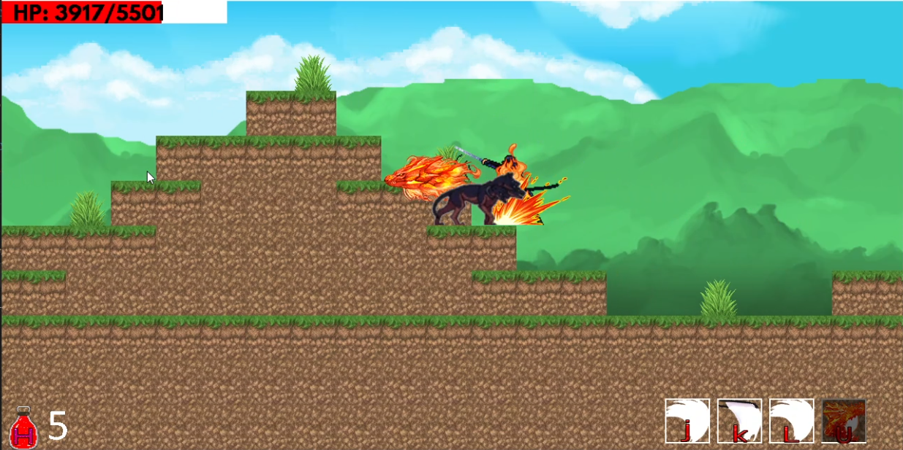

# **Samurai Combat 2D**

## ***Video Demo:***

- [Giải thích và demo gameplay](https://www.youtube.com/watch?v=v81oVOWdSM0)
- [Gameplay trên nền source code](https://youtu.be/5ahZ92ZXIkE)
  
## ***Table of Contents***
- [**Samurai Combat 2D**](#samurai-combat-2d)
    - [**Video Demo**](#video-demo)
    - [***Table of contents***](#table-of-contents)
    - [**Mô tả game**](#mô-tả-game)
    - [**Cách tải game**](#cách-tải-game)
        - [**Cài đặt môi trường**](#cài-đặt-môi-trường-cho-game-windows)
        - [**Tải game**](#tải-game)
    - [**Hướng dẫn chơi**](#hướng-dẫn-chơi)
    - [**Kỹ thuật lập trình**](#kỹ-thuật-lập-trình)
    - [**Ứng dụng**](#ứng-dụng)
    - [**Về đồ họa**](#về-đồ-họa)
    - [**Nguồn tham khảo**](#nguồn-tham-khảo)
    - [**Tác giả**](#tác-giả)

## Mô tả game

- Samurai Combat 2D là một trò chơi hành động phiêu lưu 2D nơi bạn sẽ nhập vai thành một samurai chiến đấu chống lại kẻ thù.

## Cách tải game

### Cài đặt môi trường cho game (windows)

1. Để chạy game bạn cần cài đặt mingw, ở đây tôi dùng mingw urct của [msys2](https://www.msys2.org/)
2. Làm theo hướng dẫn cài đặt trên web [link msys2](https://www.msys2.org/)
3. Mở Setting và tìm kiếm `Edit the system environment variables`
4. Chọn phần `path` -> edit -> new -> browse
5. Tìm đường dẫn đến file cài đặt của MSYS2, Ví dụ: `C:\msys64\ucrt64\bin`
6. Sau khi hoàn thành, bấm `OK` và khởi động lại hệ thống của bạn

### Tải game

1. Tải xuống theo: [link](https://github.com/Nezuko1909/SDL_Game_prj/releases/download/scb2d_v_0.1.0/scb2d.rar)
2. Giải nén và chạy trò chơi: scb2d.exe

## Hướng dẫn chơi

Khi vào game, bấm nút start để bắt đầu chơi game. 
Sau đó bấm vào level bạn muốn chơi. Hiện tại có 3 level với độ khó tăng dần theo level.

- Bấm ESC để tạm dừng game
- Sử dụng các phím a, d, space để di chuyển nhân vật của bạn.
- Sử dụng phím j, k, l, u để tấn công và tiêu diệt kẻ thù.
- Sử dụng phím h để hồi máu.
- Tránh các đòn tấn công của kẻ thù.

## Kỹ thuật lập trình
### ***Phát triển trên nền tảng:***
- IDE Visual Studio Code
- Ngôn ngữ lập trình C++
- Thư viện SDL2
- Extension của SDL2:
    - SDL_Image: Hỗ trợ xử lý hình ảnh
    - SDL_Mixer: Hỗ trợ xử lý âm thanh
    - SDL_Ttf: Hỗ trợ xử lý fonts chữ
- Lưu và quản lý code bằng [Git](https://github.com/)

### ***Các kỹ thuật lập trình:***
- Gồm tất cả các kỹ thuật:
    - Vòng lặp, cấu trúc rẽ nhánh,...
    - Con trỏ, vector, string,...
    - Class: Tạo, hủy, member function
    - Đọc viết file: fstream
    - Tách file quản lý code
    - Kỹ thuật duyệt mảng, sinh số ngẫu nhiên
    - Thay đổi đường dẫn file theo level và đối tượng
    - Các kỹ thuật, syntax của SDL
    - Kỹ thuật giải phóng bộ nhớ
    - Kỹ thuật xử lý thời gian

## Ứng dụng
- Mỗi chức năng của game (Map, Main Player, Threats, Text,...) được xác định bằng 1 đối tượng (class) riêng biệt.
- Xây dựng Tile Map.
- Xử lý tương tác map.
- Kiểm tra - xử lý va chạm giữa các đối tượng.
- Sử dụng Vector để lưu trữ Threats - kẻ địch.
- Sử dụng các vòng lặp để liên tục xử lý các sự kiện và hiển thị hình ảnh trong game.
- Xử lý FPS - Frame Per Second điều chỉnh tốc độ game.

## Về đồ họa
- Các texture trong game được lấy từ:
    - Map [resourcepack](https://resourcepack.net/)
    - Nhân vật và Kẻ địch [crafpix](https://craftpix.net/)
    - Hiệu ứng được lấy từ [NSO - 1 tựa game được phát triển bởi teamobi](http://ninjaschool.vn/) và [crafpix](https://craftpix.net/)
- Bản đồ được xây dựng bằng [Tiled](https://www.mapeditor.org/)
- Tất cả texture đều được chỉnh sửa và vẽ lại một phần để phù hợp với game.

## Nguồn tham khảo
1. [lazyfoo](https://lazyfoo.net/tutorials/SDL)
2. Youtube: [Phát Triển Phần Mềm 123A-Z](https://www.youtube.com/@PhatTrienPhanMem123AZ)

- Khung ban đầu được tham khảo từ [phattrienphanmem123az](https://www.youtube.com/@PhatTrienPhanMem123AZ)
- Cách dùng hàm của SDL được tham khảo từ [lazyfoo](https://lazyfoo.net/tutorials/SDL/)

# Tác giả
 - Tv.Quyên

